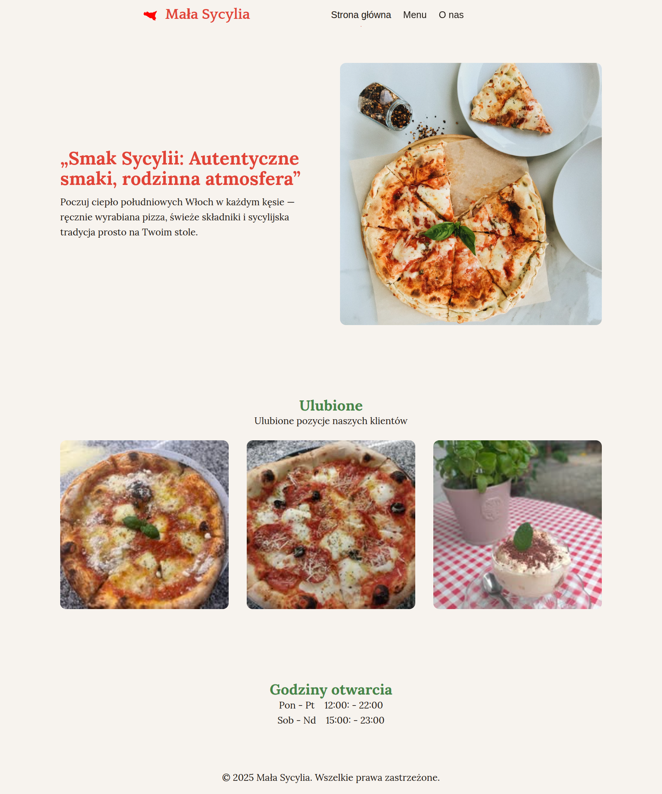

# Restaurant Page

A simple restaurant homepage built with JavaScript, HTML, and CSS — developed as part of The Odin Project's JavaScript curriculum.

## Description

This project is a mock restaurant website where all page content is dynamically generated using JavaScript modules. The goal was to practice DOM manipulation, modular JS structure, and bundling with Webpack — without writing static HTML for each section of the page.

The site includes multiple pages (Home, Menu, Contact), and switching between them updates the content without reloading the page.

## Features

* Fully JavaScript-generated content (no inner HTML)
* ES6 Modules for clean, reusable code
* Basic page routing between sections
* Styled with custom CSS
* Bundled using Webpack

## Demo

[**Live Demo**](https://kacper-korzen.github.io/restaurant-page/)
[**Project Specs**](https://www.theodinproject.com/lessons/node-path-javascript-restaurant-page#project-solution)

## Screenshots



## Getting Started

1. Clone this repository:
   ```bash
   git clone https://github.com/kacper-korzen/restaurant-page.git
   cd restaurant-page

   ```bash
   npm install

   ```bash
   npm run build

   ```bash
   npm run start
  

## License

This project is licensed under the MIT License. See [`LICENSE`](https://choosealicense.com/licenses/mit/)  for details.


## Acknowledgments

- The Odin Project for providing the curriculum and resources
- Unsplash for providing the images


## Authors

- [@Kacper K](https://www.github.com/kacper-korzen)
